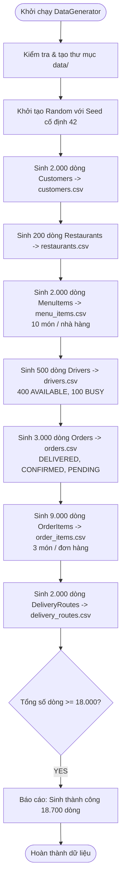

# FLOWCHART 4: DATA GENERATOR FLOW (Luồng Sinh Dữ Liệu CSV Chuẩn)

```mermaid
flowchart TD
    StartGen([Khởi chạy DataGenerator]) --> EnsureDir[Kiểm tra & tạo thư mục data/]
    EnsureDir --> InitRand[Khởi tạo Random với Seed cố định 42]
    
    InitRand --> GenCust[Sinh 2.000 dòng Customers -> customers.csv]
    GenCust --> GenRest[Sinh 200 dòng Restaurants -> restaurants.csv]
    GenRest --> GenMenu[Sinh 2.000 dòng MenuItems -> menu_items.csv<br/>10 món / nhà hàng]
    GenMenu --> GenDriver[Sinh 500 dòng Drivers -> drivers.csv<br/>400 AVAILABLE, 100 BUSY]
    GenDriver --> GenOrder[Sinh 3.000 dòng Orders -> orders.csv<br/>DELIVERED, CONFIRMED, PENDING]
    GenOrder --> GenItem[Sinh 9.000 dòng OrderItems -> order_items.csv<br/>3 món / đơn hàng]
    GenItem --> GenRoute[Sinh 2.000 dòng DeliveryRoutes -> delivery_routes.csv]
    
    GenRoute --> CheckTotal{Tổng số dòng >= 18.000?}
    CheckTotal -- YES --> ReportSuccess[Báo cáo: Sinh thành công 18.700 dòng]
    ReportSuccess --> EndGen([Hoàn thành dữ liệu])
```
