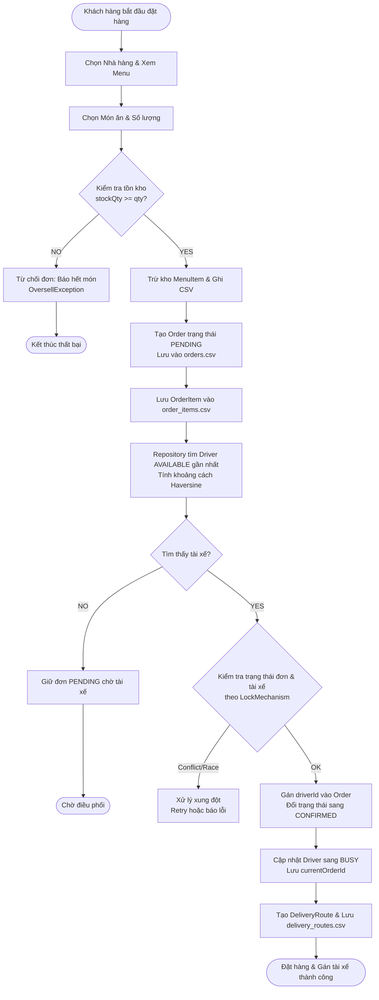

# FLOWCHART 1: ORDER & DISPATCH FLOW (Luồng Đặt Hàng và Điều Phối Tài Xế)

```mermaid
flowchart TD
    Start([Khách hàng bắt đầu đặt hàng]) --> SelectRest[Chọn Nhà hàng & Xem Menu]
    SelectRest --> ChooseItems[Chọn Món ăn & Số lượng]
    ChooseItems --> CheckStock{Kiểm tra tồn kho<br/>stockQty >= qty?}
    
    CheckStock -- NO --> RejectOrder[Từ chối đơn: Báo hết món<br/>OversellException]
    RejectOrder --> EndFail([Kết thúc thất bại])
    
    CheckStock -- YES --> DeductStock[Trừ kho MenuItem & Ghi CSV]
    DeductStock --> CreatePending[Tạo Order trạng thái PENDING<br/>Lưu vào orders.csv]
    CreatePending --> SaveItems[Lưu OrderItem vào order_items.csv]
    
    SaveItems --> FindDriver[Repository tìm Driver AVAILABLE gần nhất<br/>Tính khoảng cách Haversine]
    FindDriver --> DriverFound{Tìm thấy tài xế?}
    
    DriverFound -- NO --> KeepPending[Giữ đơn PENDING chờ tài xế]
    KeepPending --> EndPending([Chờ điều phối])
    
    DriverFound -- YES --> LockAssign{Kiểm tra trạng thái đơn & tài xế<br/>theo LockMechanism}
    LockAssign -- Conflict/Race --> HandleConflict[Xử lý xung đột<br/>Retry hoặc báo lỗi]
    
    LockAssign -- OK --> AssignOrder[Gán driverId vào Order<br/>Đổi trạng thái sang CONFIRMED]
    AssignOrder --> MarkBusy[Cập nhật Driver sang BUSY<br/>Lưu currentOrderId]
    MarkBusy --> SaveRoutes[Tạo DeliveryRoute & Lưu delivery_routes.csv]
    SaveRoutes --> EndSuccess([Đặt hàng & Gán tài xế thành công])
```
