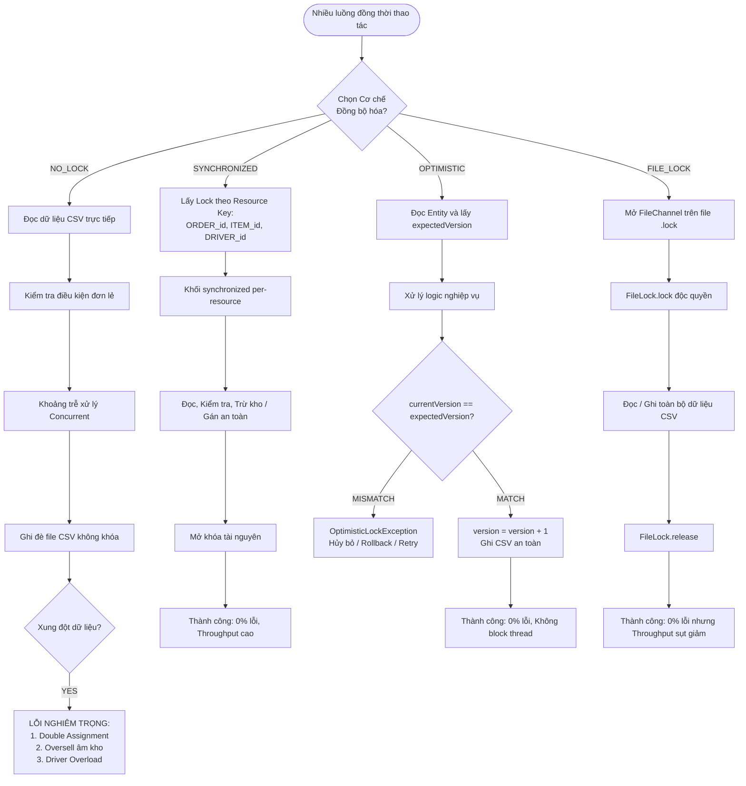

# FLOWCHART 2: RACE CONDITION MECHANISM COMPARISON (So Sánh 4 Cơ Chế Đồng Bộ Hóa)

```mermaid
flowchart TD
    Req([Nhiều luồng đồng thời thao tác]) --> ChooseMech{Chọn Cơ chế<br/>Đồng bộ hóa?}

    %% NO_LOCK
    ChooseMech -- NO_LOCK --> NL_Read[Đọc dữ liệu CSV trực tiếp]
    NL_Read --> NL_Check[Kiểm tra điều kiện đơn lẻ]
    NL_Check --> NL_RaceWindow[Khoảng trễ xử lý Concurrent]
    NL_RaceWindow --> NL_Write[Ghi đè file CSV không khóa]
    NL_Write --> NL_Bug{Xung đột dữ liệu?}
    NL_Bug -- YES --> NL_Errors[LỖI NGHIÊM TRỌNG:<br/>1. Double Assignment<br/>2. Oversell âm kho<br/>3. Driver Overload]

    %% SYNCHRONIZED
    ChooseMech -- SYNCHRONIZED --> SY_Key[Lấy Lock theo Resource Key:<br/>ORDER_id, ITEM_id, DRIVER_id]
    SY_Key --> SY_SyncBlock[Khối synchronized per-resource]
    SY_SyncBlock --> SY_Atomic[Đọc, Kiểm tra, Trừ kho / Gán an toàn]
    SY_Atomic --> SY_Release[Mở khóa tài nguyên]
    SY_Release --> SY_Success[Thành công: 0% lỗi, Throughput cao]

    %% OPTIMISTIC
    ChooseMech -- OPTIMISTIC --> OP_Read[Đọc Entity và lấy expectedVersion]
    OP_Read --> OP_Compute[Xử lý logic nghiệp vụ]
    OP_Compute --> OP_CheckVer{currentVersion == expectedVersion?}
    OP_CheckVer -- MISMATCH --> OP_Conflict[OptimisticLockException<br/>Hủy bỏ / Rollback / Retry]
    OP_CheckVer -- MATCH --> OP_Inc[version = version + 1<br/>Ghi CSV an toàn]
    OP_Inc --> OP_Success[Thành công: 0% lỗi, Không block thread]

    %% FILE_LOCK
    ChooseMech -- FILE_LOCK --> FL_Chan[Mở FileChannel trên file .lock]
    FL_Chan --> FL_Acquire[FileLock.lock độc quyền]
    FL_Acquire --> FL_IO[Đọc / Ghi toàn bộ dữ liệu CSV]
    FL_IO --> FL_Release[FileLock.release]
    FL_Release --> FL_Success[Thành công: 0% lỗi nhưng Throughput sụt giảm]
```
