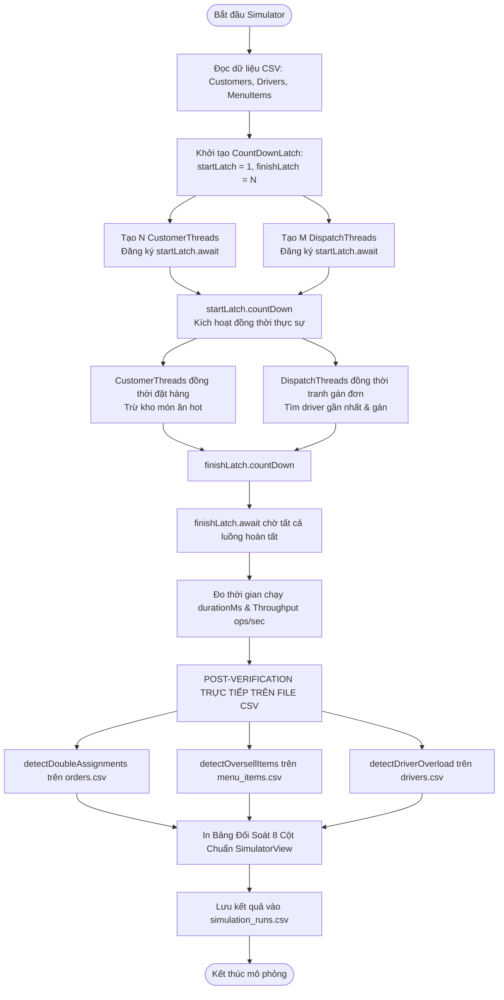

# FLOWCHART 3: SIMULATOR TOOL CONCURRENT FLOW (Luồng Mô Phỏng Đồng Thời 2 Loại Thread)

```mermaid
flowchart TD
    Init([Bắt đầu Simulator]) --> Prep[Đọc dữ liệu CSV: Customers, Drivers, MenuItems]
    Prep --> CreateLatches[Khởi tạo CountDownLatch:<br/>startLatch = 1, finishLatch = N]
    
    CreateLatches --> SpawnCustomer[Tạo N CustomerThreads<br/>Đăng ký startLatch.await]
    CreateLatches --> SpawnDispatch[Tạo M DispatchThreads<br/>Đăng ký startLatch.await]
    
    SpawnCustomer --> LatchTrigger[startLatch.countDown<br/>Kích hoạt đồng thời thực sự]
    SpawnDispatch --> LatchTrigger
    
    LatchTrigger --> ExecCust[CustomerThreads đồng thời đặt hàng<br/>Trừ kho món ăn hot]
    LatchTrigger --> ExecDisp[DispatchThreads đồng thời tranh gán đơn<br/>Tìm driver gần nhất & gán]
    
    ExecCust --> FinishCount[finishLatch.countDown]
    ExecDisp --> FinishCount
    
    FinishCount --> WaitFinish[finishLatch.await chờ tất cả luồng hoàn tất]
    WaitFinish --> CalcTime[Đo thời gian chạy durationMs & Throughput ops/sec]
    
    CalcTime --> PostVerify[POST-VERIFICATION TRỰC TIẾP TRÊN FILE CSV]
    PostVerify --> PV1[detectDoubleAssignments trên orders.csv]
    PostVerify --> PV2[detectOversellItems trên menu_items.csv]
    PostVerify --> PV3[detectDriverOverload trên drivers.csv]
    
    PV1 --> RenderTable[In Bảng Đối Soát 8 Cột Chuẩn SimulatorView]
    PV2 --> RenderTable
    PV3 --> RenderTable
    RenderTable --> SaveRun[Lưu kết quả vào simulation_runs.csv]
    SaveRun --> Done([Kết thúc mô phỏng])
```
